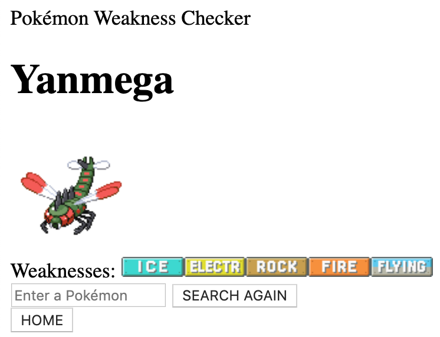

**This was created during my time as a student at Code Chrysalis.**

# Pokémon Weakness Checker

### Enter a Pokémon's name to search for its weaknesses



## How to Use

Fork and clone this repository, and navigate to its directory.

To launch the app, run the following command in your terminal:

```
go run main.go
```

Then go to **localhost:8000** in your browser.

## About

This is the first app I made in Go.

It was my assignment for Polyglottal Week, where we had 5 days to create a project in a language we had never used before.

Pokémon data comes from [PokéAPI](https://pokeapi.co/).
